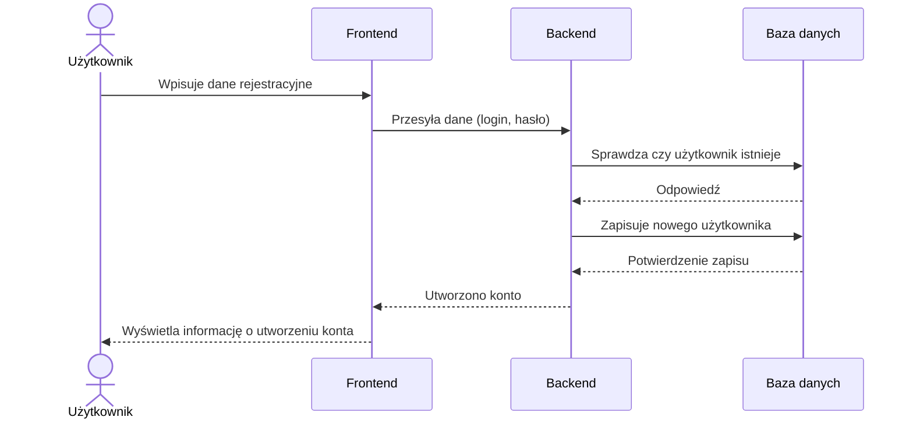
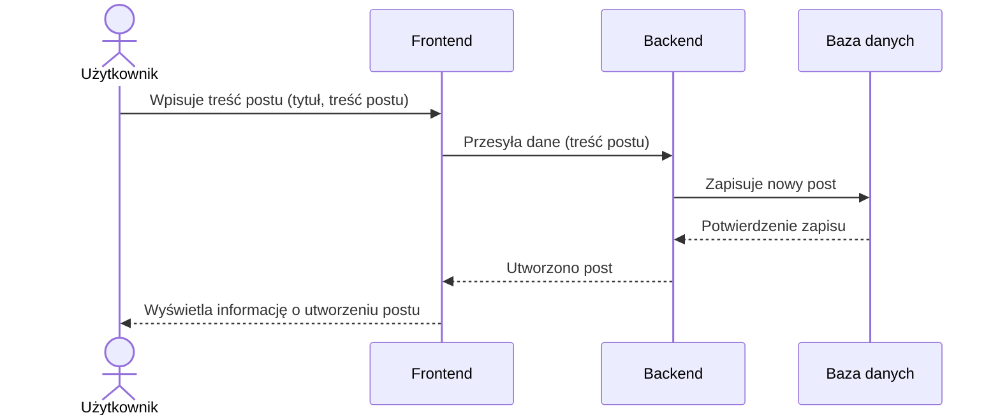
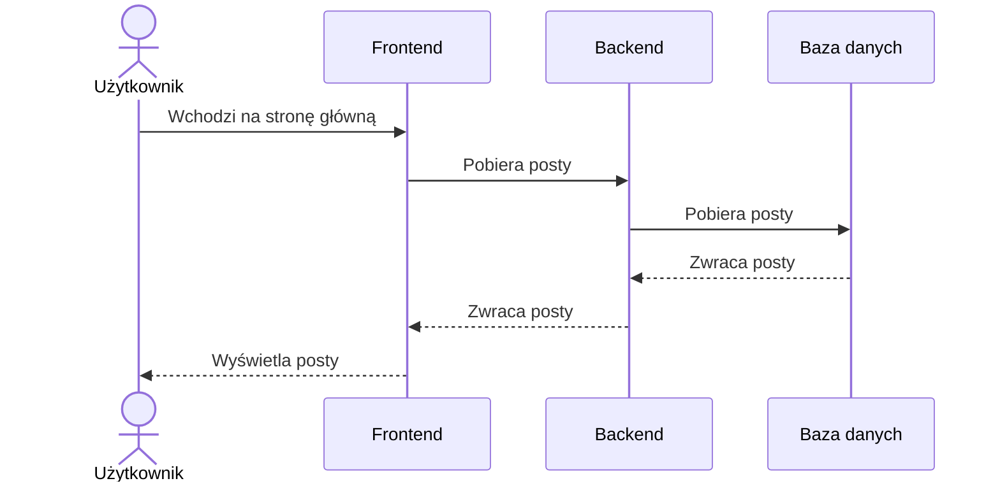
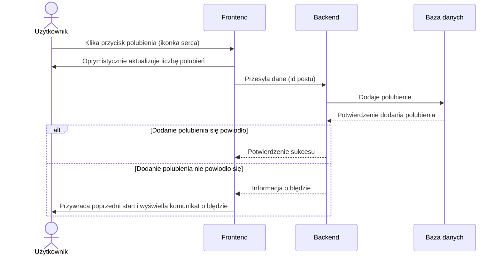
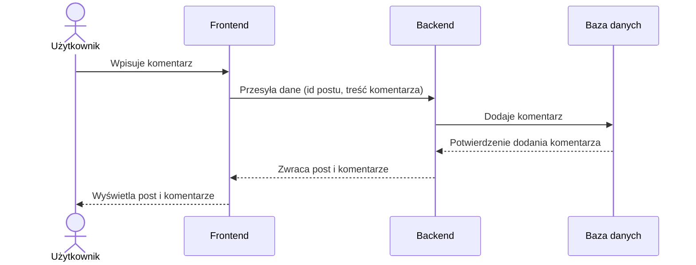
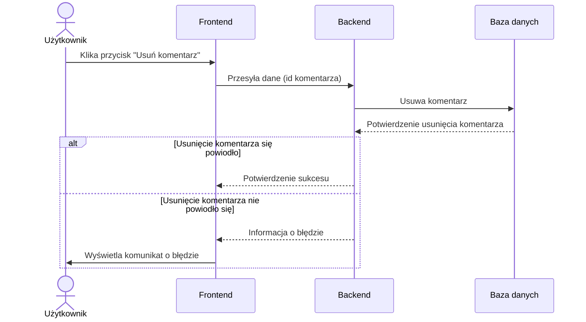

## Dokumentacja

### Identyfikacja zagadnienia biznesowego

W dobie cyfrowej, interakcje społeczne i dzielenie się informacjami przeniosły się w znacznej mierze do przestrzeni online.

Forum internetowe, na którym użytkownicy mogą publikować posty, komentować i lajkować je, pełni kluczową rolę w **tworzeniu społeczności opartej na wspólnych zainteresowaniach lub potrzebach informacyjnych.**

Z tego powodu, **stworzenie platformy do wymiany informacji i budowania relacji międzyludzkich** takiej jak ten projekt, jest ważne dla ogółu społeczeństwa.

### Wymagania funkcjonalne:

-   Rejestracja użytkownika
-   Logowanie użytkownika
-   Wylogowanie użytkownika
-   Zmiana hasła
-   Dodawanie nowego postu
-   Usuwanie postu
-   Edytowanie postu
-   Wyświetlanie postów
-   Wyświetlanie postów użytkownika
-   Polubienie postu
-   Usunięcie polubienia postu
-   Komentowanie postu
-   Usunięcie komentarza

### Wymagania techniczne:

Backend:

-   Node.js
-   Express.js

Frontend:

-   React.js

Baza danych:

-   mySQL
-   Sequelize

### Uruchomienie projektu:

Uruchomienie części backendowej:

```bash
cd server
npm install
npm start
```

Uruchomienie części frontendowej:

```bash
cd client
npm install
npm start
```

### Mockup

Mockup został stworzony korzystajac ze strony [moqups](https://moqups.com/) i znajduje się pod [linkiem](https://app.moqups.com/GLMBnFfKu7kdJmfuAGQPZUzXTCissvps/view/page/af447452d?ui=0)

### Diagramy przepływu danych

#### Funckjonalność: Rejestracja użytkownika



#### Funkcjonalność: Dodawanie postu



#### Funkcjonalność: Wyświetlanie postów



#### Funkcjonalność: Polubienie postu



#### Funkcjonalność: Komentowanie postu



#### Funkcjonalność: Usunięcie komentarza



### Implementacja funkcjonalności

#### Rejestracja użytkownika

##### Opis

-   Endpoint: `POST /user`
-   Opis: Tworzy nowego użytkownika z podanym loginem i hasłem w ciele zapytania. Hasło jest szyfrowane przed zapisaniem do bazy danych (korzystając z bcrypt i 10 rund hashowania).
-   Jeśli użytkownik o podanym loginie już istnieje, zwraca błąd, w przeciwnym wypadku zwraca informację o utworzeniu konta.

```javascript
router.post("/", async (req, res) => {
    const { username, password } = req.body;

    // try to find user with given username
    const user = await Users.findOne({
        where: {
            username: username,
        },
    });

    if (user) res.json({ error: "User already exists" });
    else {
        // encrypt the password and add the user to Users table
        bcrypt.hash(password, 10).then((hash) => {
            Users.create({
                username: username,
                password: hash,
            });
            res.json("User created");
        });
    }
});
```

#### Logowanie użytkownika i autoryzacja

##### Opis

-   Endpoint: `POST /user/login`
-   Opis: Loguje użytkownika do serwisu, jeśli użytkownik o podanym loginie istnieje i hasło podane w ciele zapytania jest poprawne.
-   Hasło jest porównywane z zahaszowanym hasłem w bazie danych i jeśli są takie same, tworzony jest token JWT, który jest zwracany w odpowiedzi (służy do autoryzacji użytkownika).

```javascript
router.post("/login", async (req, res) => {
    const { username, password } = req.body;

    // try to find user with given username
    const user = await Users.findOne({
        where: {
            username: username,
        },
    });

    // no user with given username found
    if (!user) res.json({ error: "User doesn't exist" });
    else {
        // check the hash of the given password with the hash in database
        bcrypt.compare(password, user.password).then((matches) => {
            if (!matches)
                res.json({ error: "Wrong username and password combination" });
            else {
                // create the access token using JWT and secret key
                const accessToken = sign(
                    { username: user.username, id: user.id },
                    "KacperPiatkowski"
                );
                res.json({
                    token: accessToken,
                    username: user.username,
                    id: user.id,
                });
            }
        });
    }
});
```

##### Autoryzacja

-   Middleware: `AuthMiddleware.js`
-   Opis: Middleware, który sprawdza czy użytkownik jest zalogowany (czy posiada token JWT w nagłówku zapytania).
-   Jeśli użytkownik jest zalogowany, dekoduje token i dodaje do obiektu `req` pole `user` z informacjami o użytkowniku.

```javascript
const validateToken = (req, res, next) => {
    const accessToken = req.header("accessToken");

    // when the accessToken is not present immediately end verification with error
    if (!accessToken) return res.json({ error: "User not logged in" });
    try {
        // verify the accessToken with the secret key
        const validToken = verify(accessToken, "secret");
        if (validToken) {
            // validation was succesfull
            req.user = validToken;
            return next();
        }
    } catch (err) {
        return res.json({ error: err });
    }
};
```

#### Zmiana hasła

##### Opis

-   Endpoint: `PUT /user/changepassword`
-   Opis: Zmienia hasło użytkownika, jeśli stare hasło podane w ciele zapytania jest poprawne.
-   Hasło jest porównywane z zahaszowanym hasłem w bazie danych i jeśli są takie same, nowe hasło jest zapisywane w bazie danych (po zahashowaniu).

```javascript
router.put("/changepassword", validateToken, async (req, res) => {
    const { oldPassword, newPassword } = req.body;

    // find user so that we can compare the given password with the one in database
    const user = await Users.findOne({
        where: {
            username: req.user.username, // we get username from validiation
        },
    });

    // check the hash of the given password with the hash in database
    bcrypt.compare(oldPassword, user.password).then(async (matches) => {
        if (!matches) res.json({ error: "Wrong password entered" });
        else {
            // hash new password and update the password cell
            bcrypt.hash(newPassword, 10).then((hash) => {
                Users.update(
                    { password: hash },
                    {
                        where: {
                            username: req.user.username,
                        },
                    }
                );
                res.json("Success");
            });
        }
    });
});
```

#### Dodawanie postu

##### Opis

-   Endpoint: `POST /posts`
-   Opis: Tworzy nowy post z podanym tytułem i treścią w ciele zapytania. Dodaje również id użytkownika i nazwę użytkownika z walidacji.
-   Endpoint jest zabezpieczony middleware `validateToken`, który sprawdza czy użytkownik jest zalogowany.

```javascript
router.post("/", validateToken, async (req, res) => {
    const post = req.body;
    post.UserId = req.user.id;
    post.username = req.user.username;
    await Posts.create(post);
    res.json(post);
});
```

#### Dodawanie komentarza

##### Opis

-   Endpoint: `POST /comments`
-   Opis: Tworzy nowy komentarz z podaną treścią w ciele zapytania. Dodaje również nazwę użytkownika z walidacji.
-   Endpoint jest zabezpieczony middleware `validateToken`, który sprawdza czy użytkownik jest zalogowany.

```javascript
router.post("/", validateToken, async (req, res) => {
    const comment = req.body;
    const username = req.user.username;
    comment.username = username;
    await Comments.create(comment);
    res.json(comment);
});
```

#### Polubienie postu

##### Opis

-   Endpoint: `POST /likes`
-   Opis: Dodaje polubienie do postu o podanym id w ciele zapytania. Jeśli polubienie już istnieje, usuwa je.
-   Endpoint jest zabezpieczony middleware `validateToken`, który sprawdza czy użytkownik jest zalogowany.

```javascript
router.post("/", validateToken, async (req, res) => {
    const { PostId } = req.body;
    const UserId = req.user.id;

    // check if the like already exist
    const found = await Likes.findOne({
        where: {
            PostId: PostId,
            UserId: UserId,
        },
    });

    if (!found) {
        // if the like doesn't exist - create it (like the post)
        await Likes.create({
            PostId: PostId,
            UserId: UserId,
        });
        res.json({ liked: true });
    } else {
        // else delete it (dislike the post)
        await Likes.destroy({
            where: {
                PostId: PostId,
                UserId: UserId,
            },
        });
        res.json({ liked: false });
    }
});
```
